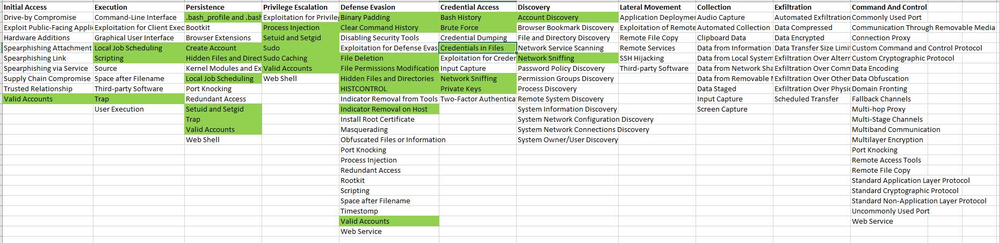

The objective of this project is to create a knowledgebase that helps in creating/improving detection capabilities of Linux threathunting for the blue teams. The attack vectors are aligned with MITRE’s ATT&CK framework. 

I have taken most of the attack test-cases from the atomic tests of [Atomic Red Team](https://github.com/redcanaryco/atomic-red-team) and then demonstrated how to detect them and which logsources would be required to capture these attacks.

I have tried to align the look and feel of the project with Atomic Red Team’s project. Big Thanks to @redcanaryco's [Atomic Red Team](https://github.com/redcanaryco/atomic-red-team) for creating such a wonderful project. @redcanaryco/atomic-red-team

In general, the rule of thumb is that whitelisting is very important in any threat hunting activities, you got to absolutely know what is normal in your environment that will help to identify the abnormalities from the generated alerts. 

## The alerts are only as effective as the knowledge of normalcy.

I am releasing this with a small set of usecases and I would build this project as I get time and resources. 
A sample audit.rules file is also attached that I used for my research; you can modify as per your requirements. Moreover, in a few splunk queries, “syscall_name” field is used – this field does not get logged in audit.log file. Only syscall numbers are logged in audit.log file. You may need to create the Splunk lookup to fetch the syscall name based on the syscall number. I have attached the lookup file “syscall.csv”. 

I would like to thank @olafhartong and @redcanaryco's atomic red team for their inspirational work. 

The coverage is shown below in the navigator

 # Start Here :[Detecting ATT&CK techniques & tactics for Linux](https://github.com/Kirtar22/Litmus_Test/blob/master/README.md)
